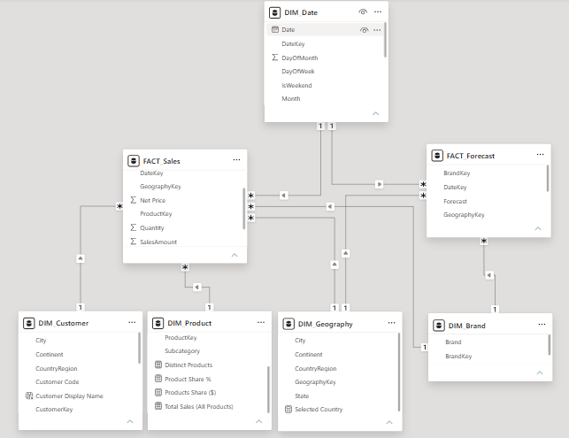
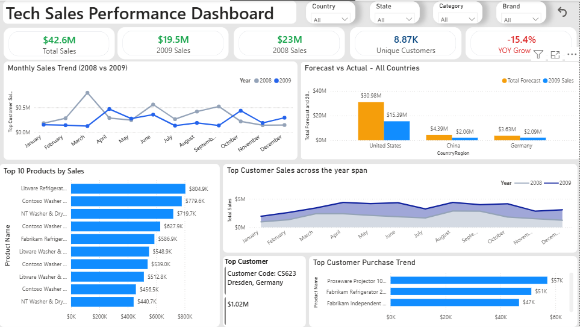

# Tech Sales Analytics Project Documentation

## Project Overview

### Objective

The objective of this project is to design and implement a complete Data Engineering and Business Analytics solution for a technology retail company.

The solution transforms raw, semi-structured sales data into a structured dimensional model using Python ETL and visualizes business insights using Power BI.

The dashboard enables the Sales Department to analyze:

- Sales performance
- Customer purchasing behavior
- Product performance
- Forecast accuracy
- Geographic sales distribution

---

# Solution Architecture

```
                Raw Sales JSON
                      +
               Raw Forecast Json
                      |
                      |
              Python ETL Pipeline
                      |
    ------------------------------------
    |        |        |        |        |
Dimensions  Facts  Validation Cleaning Logging
    |         |
    |         |
Structured CSV Files
    |
    |
Power BI Data Model
    |
Interactive Dashboard
```

---

# Project Structure

```
Tech-Sales-Analytics
|
├── main.py                  
├── config.py                
│
├── src/
│   ├── extractor.py
│   ├── transformer.py
│   ├── dimensions.py
│   ├── fact.py
│   ├── validation.py
│   └── loader.py
│
├── input/
│       ├── sales.json
│       └── forecast.csv
│   
|── output/
│       ├── DIM_Product.csv
│       ├── DIM_Customer.csv
│       ├── DIM_Date.csv
│       ├── DIM_Geography.csv
│       ├── DIM_Brand.csv
│       ├── FACT_Sales.csv
│       └── FACT_Forecast.csv
│
|__ Logs/
|     |__ RunData/
|            |___ RunTimestamp-Logs.log
|
├── powerbi
│   ├── TechSalesDashboard.pbix
│   └── Dashboard.png
|   └── Data Model.png
│
├── Documentation.md
├── README.md
```

---

# ETL Pipeline

The ETL pipeline follows the standard Extract, Transform and Load architecture.

---

## 1. Extract

### Purpose

Read the raw data from the source files.

### Source Files

- Sales JSON
- Forecast Json

### Validation Performed

- File exists
- Correct file format
- Required columns exist
- Data loaded successfully

Output:

```
Raw DataFrames
```

---

## 2. Transform

The transformation layer prepares the data for analytical reporting.

### Data Cleaning

The following operations are performed:

- Remove duplicate records
- Trim whitespace
- Standardize text formatting
- Handle missing values
- Convert numeric columns
- Convert dates
- Remove invalid values
- Remove negative prices
- Calculate sales amount
- Extract color from product name

### Business Rules

Sales Amount

```
SalesAmount = Quantity × Net Price
```

Missing values are replaced with:

| Column | Default Value |
|---------|---------------|
| Name | Unknown Customer |
| Brand | Unknown |
| Education | Unknown |
| Occupation | Unknown |
| City | Unknown |
| State | Unknown |
| Country | Unknown |

---

## 3. Dimension Creation

The project follows a Star Schema.

### DIM_Product

Contains

- ProductKey
- Product Name
- Category
- Subcategory
- Brand
- Color

Purpose

Product master data.

---

### DIM_Customer

Contains

- CustomerKey
- Customer Code
- Name
- Education
- Occupation
- Geography information

Purpose

Customer master data.

---

### DIM_Date

Generated using Python.

Contains

- DateKey
- Date
- Year
- Quarter
- Month
- Month Name
- Day
- Week
- IsWeekend

Purpose

Supports Time Intelligence calculations.

---

### DIM_Geography

Contains

- GeographyKey
- CountryRegion
- State
- City
- Continent

Purpose

Shared dimension for Sales and Forecast.

---

### DIM_Brand

Contains

- BrandKey
- Brand

Purpose

Shared dimension between Sales and Forecast.

---

## 4. Fact Tables

### FACT_Sales

Grain
One row per sales transaction.

Measures
- Quantity
- Net Price
- Sales Amount

Foreign Keys
- ProductKey
- CustomerKey
- DateKey
- GeographyKey
- BrandKey

---

### FACT_Forecast

Grain

One row per
Brand × Geography × Year

Measures
Forecast

Foreign Keys
- BrandKey
- GeographyKey
- DateKey

---

## 5. Load

The transformed data is exported into CSV files.

Generated files:

- DIM_Product.csv
- DIM_Customer.csv
- DIM_Date.csv
- DIM_Geography.csv
- DIM_Brand.csv
- FACT_Sales.csv
- FACT_Forecast.csv

These files are imported into Power BI.

---

# Data Model

The project uses a Star Schema.

```md

```

---

## Relationships

| From | To | Type |
|-------|----|------|
| DIM_Product | FACT_Sales | One-to-Many |
| DIM_Customer | FACT_Sales | One-to-Many |
| DIM_Date | FACT_Sales | One-to-Many |
| DIM_Date | FACT_Forecast | One-to-Many |
| DIM_Brand | FACT_Sales | One-to-Many |
| DIM_Brand | FACT_Forecast | One-to-Many |
| DIM_Geography | FACT_Sales | One-to-Many |
| DIM_Geography | FACT_Forecast | One-to-Many |

Cross Filter Direction

Single

---

# Power BI Dashboard

The dashboard provides an executive summary of sales performance.


## Dashboard Preview

```md

```

## KPI Cards

- Total Sales
- 2009 Sales
- 2008 Sales
- Total Forecast
- YoY Growth %

---

## Visualizations

### Monthly Sales Trend

Purpose

Compare monthly sales between 2008 and 2009.

Chart

Line Chart

---

### Forecast vs Actual

Purpose

Compare actual sales with forecast.

Chart

Clustered Column Chart

---

### Top 10 Products

Purpose

Identify the highest revenue generating products.

Chart

Horizontal Bar Chart

---

### Top Customer Sales Trend

Purpose

Analyze purchasing behavior of the highest-value customer throughout the year.

Chart

Area Chart

---

### Products Purchased by Top Customer

Purpose

Identify products purchased by the highest-value customer.

Chart

Horizontal Bar Chart

---

### Slicers

The dashboard supports filtering by

- Country
- State
- Brand
- Category

---

# DAX Measures

Examples

Total Sales

```
SUM(FACT_Sales[SalesAmount])
```

Sales 2009

```
CALCULATE(
    [Total Sales],
    DIM_Date[Year]=2009
)
```

Sales 2008

```
CALCULATE(
    [Total Sales],
    DIM_Date[Year]=2008
)
```

YoY Growth %

```
DIVIDE(
    [Sales 2009]-[Sales 2008],
    [Sales 2008]
)
```

Top Product Share %

```
DIVIDE(
    [Total Sales],
    CALCULATE(
        [Total Sales],
        ALL(DIM_Product)
    )
)
```

Products Share ($)

```
CALCULATE(
    [Total Sales],
     ALL(DIM_Product)
     )
```

Top Customer

```
MAXX(
    TOPN(
        1,
        ALL(DIM_Customer),
        [Total Sales],
        DESC
    ),
    DIM_Customer[CustomerKey]
)
```

---

# Data Quality Validation

The ETL validates:

✓ Missing values

✓ Duplicate records

✓ Invalid data types

✓ Invalid dates

✓ Missing foreign keys

✓ Numeric conversions

✓ Null replacements

---

# Assumptions

The following assumptions were made during development.

- Forecast values are yearly totals.
- Forecast DateKey is mapped to January 1st of each year.
- Sales Amount equals Quantity multiplied by Net Price.
- Unknown customer names are replaced with "Unknown Customer".
- 
- Shared Geography and Brand dimensions are used by both fact tables.
- Date Dimension covers the reporting period from 2008 to 2009.

---

## Business Insights

• 2009 sales declined by 15.4% compared to 2008.

• The United States generated the highest revenue.

• Refrigerator and Washer categories dominate sales.

• Forecast values exceed actual sales in all countries.

• Customer CS623 is the highest-value customer.

---

# Technologies Used

Python

Pandas

NumPy

Power BI

DAX

Git

GitHub

---

# Conclusion

This project demonstrates a complete end-to-end analytics solution by transforming raw sales data into a clean dimensional model and presenting business insights through an interactive Power BI dashboard.

The solution follows Data Engineering and Business Intelligence best practices including:

- Modular ETL architecture
- Data validation
- Star Schema modeling
- Optimized Power BI relationships
- Interactive dashboard with business-focused KPIs
- Professional documentation suitable for production and portfolio presentation
